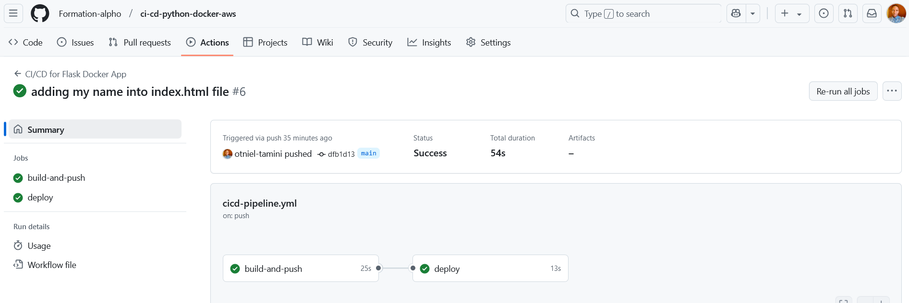
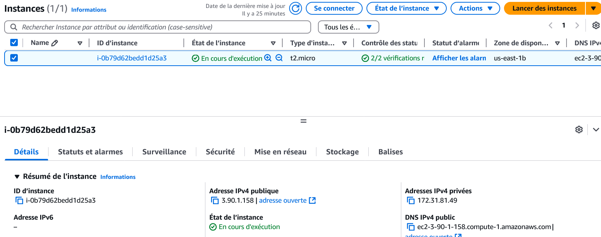
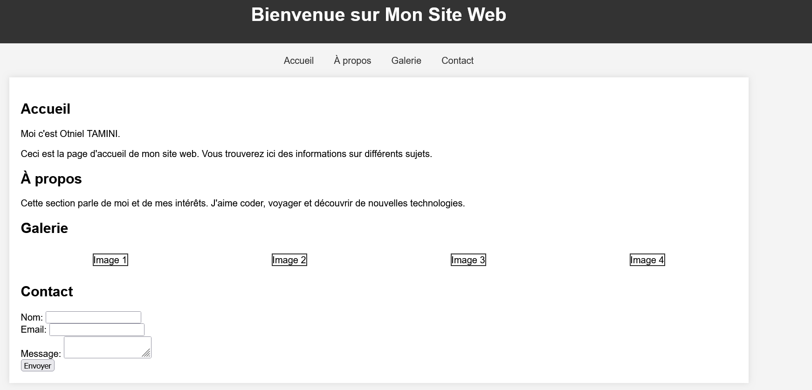

# CI/CD Pipeline with GitHub Actions, Docker, and AWS EC2

This project demonstrates a CI/CD pipeline for deploying a Node.js application using **GitHub Actions**, **Docker**, and **AWS EC2**.

## Features
- **Continuous Integration (CI)**: Automated build and testing on every commit.
- **Continuous Deployment (CD)**: Automatic deployment to an AWS EC2 instance after successful tests.
- **Dockerized Environment**: Ensures consistency across development and production.

## Pipeline Workflow
1. **Push Changes**: Code changes are pushed to the GitHub repository.
2. **CI Step**:
   - Build the Docker image.
   - Run tests to validate the application.
3. **CD Step**:
   - Push the Docker image to Docker Hub.
   - SSH into the EC2 instance, pull the latest image, and restart the container.

## Prerequisites
- AWS EC2 instance with Docker installed.
- GitHub Actions secrets configured:
  - `DOCKER_USERNAME` and `DOCKER_PASSWORD` (Docker Hub credentials).
  - `EC2_HOST`, `EC2_USER`, and `EC2_PRIVATE_KEY` (EC2 SSH access).

## Usage
1. Clone the repository:
   ```bash
   git clone https://github.com/Formation-alpho/ci-cd-python-docker-aws


## Screenshots

### GitHub Actions Workflow


### Docker Hub Repository


### EC2 instance Commands


### Browser Output

